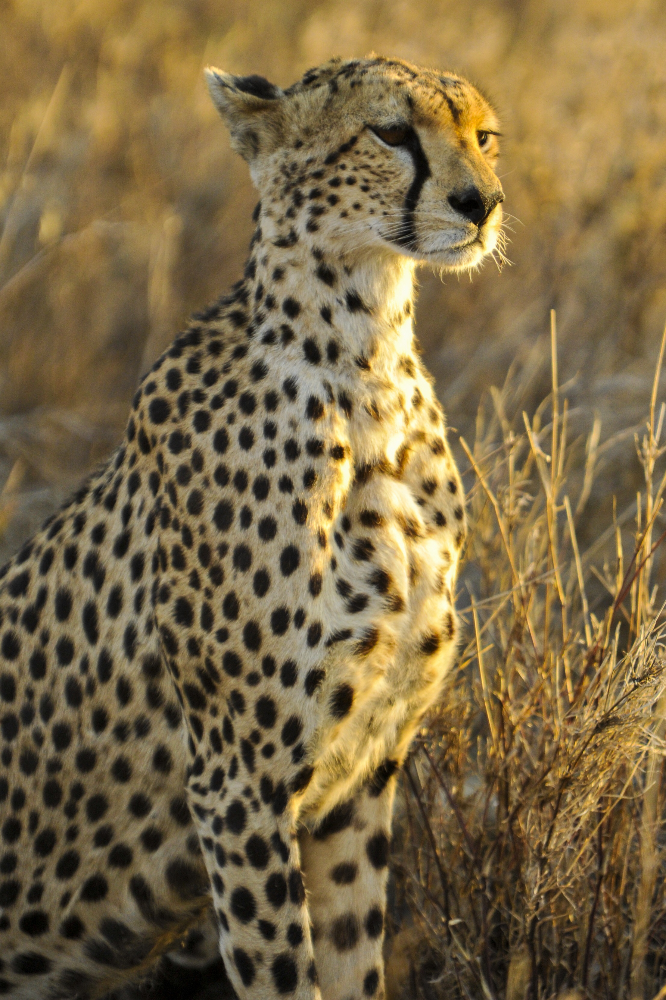

# Cheetah

  

*Гепард - это величественное животное, которое имеет длину тела от двух до трёх метров, а также высоту в холке около метра. Вес взрослого животного – до 130 кг. Шерсть у гепарда длинная и густая, окрас преимущественно песочный и желтый. Уши и хвост длинные. Гепарды обитают в Африке. Эти животные живут на открытых равнинах, которые покрыты травой и кустарником. В некоторых случаях встречаются и в зарослях.*

## Интересные факты
- Черные линии на морде помогают животному видеть дальше на ярком солнце.
- Гепарды в отличие от больших кошек (льва, тигра, ягуара, леопарда) не умеют рычать, зато умеют мурлыкать как маленькие кошки.
- На поиски добычи гепарды выходят в утреннее или в вечернее время, а в жаркие дневные часы они предпочитают отдыхать в тени.
